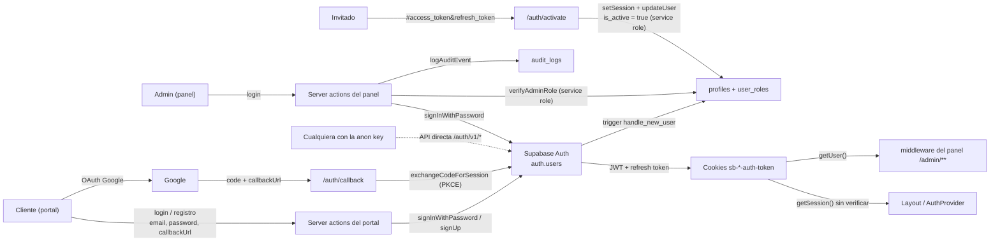

# Fase 1 — Diagnóstico NIST CSF 2.0 · Módulo de Autenticación (`auth`)

- **Responsable:** Paula
- **Rama:** `security/auth/fase1-diagnostico`
- **Commit base analizado:** `5af5fb1` (`develop`, 2026-09-28) para P1.1; `11fa71e` para P1.2 (el merge de
  `develop` solo trajo documentación, el código del módulo no cambió)
- **Estado:** P1.1 y P1.2 completos · P1.3–P1.4 pendientes

> Escala usada para valorar activos (C/I/D = confidencialidad, integridad, disponibilidad):
> **A** = alto, **M** = medio, **B** = bajo. La criticidad del activo es el valor más alto de las tres.

---

## 1. Inventario de activos (P1.1) — NIST CSF ID.AM

### 1.1 Activos de información (datos)

| ID | Activo | Dónde vive | Quién lo usa | C | I | D | Criticidad |
|---|---|---|---|---|---|---|---|
| AUTH-D01 | Credenciales de usuario (email + hash de contraseña) | `auth.users` (Supabase Auth) | Portal (clientes), panel (admins/owner) | A | A | M | **Alta** |
| AUTH-D02 | Sesión: `access_token` (JWT, 1 h) y `refresh_token` (con rotación) | Cookies `sb-<ref>-auth-token` que escribe `@supabase/ssr` en los 3 orígenes; memoria del navegador | Middlewares, server actions, cliente de navegador | A | A | M | **Alta** |
| AUTH-D03 | Claims del JWT (`sub`, `email`, `role` de Postgres, `user_metadata`, `app_metadata`) | Dentro de AUTH-D02 | Políticas RLS que usan `auth.uid()` y `auth.jwt()` | M | **A** | M | **Alta** |
| AUTH-D04 | Rol de la cuenta (`owner` / `admin` / `client`) | `public.user_roles` (se asigna en el trigger `handle_new_user`) | `verifyAdminRole`, RLS de varias tablas | M | **A** | M | **Alta** |
| AUTH-D05 | Estado de la cuenta (`profiles.is_active`) | `public.profiles` | Middleware del panel, `verifyAdminRole` | B | A | M | **Alta** |
| AUTH-D06 | Tokens de invitación/activación de admin (`access_token`, `refresh_token`, `type=invite` en el fragmento `#` de la URL) | Enlace del correo de invitación → `panel-admin/auth/activate` | `useActivationToken`, `verifyTokenAction`, `activateAdminAction` | A | A | B | **Alta** |
| AUTH-D07 | Invitaciones pendientes (`email`, `status`, `expires_at`, `invited_by`) | `public.pending_invitations` | Flujo de activación (compartido con Users/Joseph) | M | A | B | Media-Alta |
| AUTH-D08 | Código OAuth / PKCE (`code`) y parámetro `callbackUrl` | Query string de `portal-reservas/auth/callback` | `callback/route.ts`, `oauthService` | A | A | B | **Alta** |
| AUTH-D09 | Enlaces de verificación de email (signup) | Correo enviado por Supabase Auth → `/auth/callback` | `registerAction`, `loginAction` del portal (reenvío) | M | A | B | Media |
| AUTH-D10 | Datos de perfil al registrarse (`full_name`, metadatos libres de `signUp`) | `raw_user_meta_data` → `public.profiles` | Trigger `handle_new_user` | M | A | B | Media |
| AUTH-D11 | Eventos de auditoría de login (`auth.login.success/failed`, email, IP, user-agent, motivo) | `public.audit_logs` (módulo de Fabian) | Visor de auditoría del panel | M | **A** | M | **Alta** |
| AUTH-D12 | Logs de servidor (consola) de los flujos de auth | stdout del proceso Next.js | Operación / depuración | **A** (ver obs. O-01) | B | B | **Alta** |

### 1.2 Servicios externos y de plataforma

| ID | Servicio | Función en auth | Configuración relevante | Criticidad |
|---|---|---|---|---|
| AUTH-S01 | **Supabase Auth (GoTrue)** | Login con contraseña, signup, invitaciones, emisión/rotación de JWT, verificación de email | `config.toml`: `jwt_expiry = 3600`, `enable_refresh_token_rotation = true`, `minimum_password_length = 6`, `enable_confirmations = false` (en la sección local), `secure_password_change = false`, `site_url = http://127.0.0.1:3000` | **Alta** |
| AUTH-S02 | **Rate limiting de Supabase Auth** | Límite de fuerza bruta a nivel de proveedor | `sign_in_sign_ups = 30` por 5 min por IP, `email_sent = 2`/h; **captcha deshabilitado** | Alta |
| AUTH-S03 | **Google OAuth** (vía Supabase) | Login social en el portal | `signInWithOAuth` con `redirectTo` = `window.location.origin` + `/auth/callback?callbackUrl=…` | Alta |
| AUTH-S04 | **Postgres de Supabase + RLS** | Almacena roles y perfiles; aplica autorización con los claims del JWT | Triggers `SECURITY DEFINER` sobre `auth.users` | **Alta** |
| AUTH-S05 | **Correo transaccional** | Supabase Auth envía los correos de invitación y verificación (SMTP del proyecto). Resend (`packages/core/src/email`) se usa para otros correos de la app | SMTP propio comentado en `config.toml`; por confirmar qué proveedor usa el proyecto remoto | Media |
| AUTH-S06 | **Next.js middleware** (Edge) | Refresca la sesión (portal) y protege `/admin/**` (panel) | `matcher` del portal: todo menos estáticos; panel: `/admin/:path*`; landing: sin auth | Alta |

### 1.3 Secretos y configuración

| ID | Activo | Ubicación | Exposición | Criticidad |
|---|---|---|---|---|
| AUTH-K01 | `SUPABASE_SERVICE_ROLE_KEY` (salta RLS) | `.env.local`; se usa en `createSupabaseServiceClient` (servidor y middleware del panel) | Solo servidor; nunca debe llegar al bundle del cliente | **Crítica** |
| AUTH-K02 | `NEXT_PUBLIC_SUPABASE_ANON_KEY` + `NEXT_PUBLIC_SUPABASE_URL` | `.env.local`; incluidos en el bundle del navegador | Pública por diseño: cualquiera puede llamar directo a la API de Supabase Auth | Alta (por lo que permite) |
| AUTH-K03 | Secreto de firma JWT del proyecto Supabase | Panel de Supabase (no en el repo) | Gestionado por Supabase | **Crítica** |
| AUTH-K04 | Client ID/secret de Google OAuth | Panel de Supabase / Google Cloud | No en el repo | Alta |
| AUTH-K05 | `RESEND_API_KEY` | `.env.local` | Solo servidor | Media |
| AUTH-K06 | Cabeceras de seguridad y CSP (`next.config.ts` ×3) | `apps/*/next.config.ts` | **No hay** CSP, HSTS, `X-Frame-Options` ni `Referrer-Policy` configuradas (dueña: Paula, §4.4) | Alta |

### 1.4 Componentes de software y endpoints

| ID | Componente | Archivo | Tipo | Entrada controlada por el usuario |
|---|---|---|---|---|
| AUTH-C01 | `loginAction` (core, genérico) | `packages/core/src/auth/server/loginAction.ts` | Server action | `email`, `password`, `redirectTo` |
| AUTH-C02 | `loginAction` del panel | `apps/panel-admin/src/features/auth/services/loginAction.ts` | Server action (POST `/auth/login`) | `email`, `password` |
| AUTH-C03 | `loginAction` del portal | `apps/portal-reservas/src/features/auth/services/loginAction.ts` | Server action (POST `/auth/login`) | `email`, `password`, **`callbackUrl`**; cabecera `Origin` |
| AUTH-C04 | `registerAction` (+ `signUp` de core) | `apps/portal-reservas/src/features/auth/services/signUp-action.ts`, `packages/core/src/auth/index.ts` | Server action (POST `/auth/register`) | `fullName`, `email`, `password`; cabecera `Origin` → `emailRedirectTo` |
| AUTH-C05 | Callback OAuth / verificación de email | `apps/portal-reservas/src/app/auth/callback/route.ts` | Route handler GET `/auth/callback` | `code`, **`callbackUrl`** |
| AUTH-C06 | Página de error de auth | `apps/portal-reservas/src/app/auth/error/{page,AuthErrorContent}.tsx` | Página GET `/auth/error` | **`error`, `error_description`** (se muestran en la página) |
| AUTH-C07 | Login con Google | `apps/portal-reservas/src/features/auth/services/oauthService.ts` | Cliente | `callbackUrl` |
| AUTH-C08 | Activación de admin | `apps/panel-admin/src/app/auth/activate/page.tsx`, `hooks/useActivationToken.ts`, `services/verifyTokenAction.ts`, `services/activateAdminAction.ts` | Página + 2 server actions | `access_token`, `refresh_token`, `type`, `password` |
| AUTH-C09 | `verifyActivationToken` / `completeAdminActivation` | `packages/core/src/auth/index.ts` | Lógica de servidor (usa service role) | Tokens + contraseña |
| AUTH-C10 | `verifyAdminRole` | `packages/core/src/auth/index.ts` | Lógica de servidor (service role) | `userId` de la sesión |
| AUTH-C11 | `getServerAuthContext`, `refreshSession`, `getAuthContextAction` | `packages/core/src/auth/server/*`, `apps/panel-admin/src/features/auth/services/getAuthContextAction.ts` | Server actions / SSR | Cookies de sesión |
| AUTH-C12 | `signOutAction` (core y panel) | `packages/core/src/auth/server/signOutAction.ts`, `apps/panel-admin/.../signOutAction.ts` | Server action | Cookies de sesión |
| AUTH-C13 | Cliente de sesión del navegador | `packages/core/src/auth/client/*`, `apps/portal-reservas/src/features/auth/services/authSessionService.ts` | Cliente | — |
| AUTH-C14 | Middleware del panel | `apps/panel-admin/src/middleware.ts` | Middleware | Cookies; consulta `profiles.is_active` con service role |
| AUTH-C15 | Middleware del portal | `apps/portal-reservas/src/middleware.ts` | Middleware | Cookies (solo refresca la sesión, no protege rutas) |
| AUTH-C16 | Middleware del landing | `apps/landing/src/middleware.ts` | Middleware | Solo locale; sin auth |
| AUTH-C17 | Fábricas de cliente Supabase | `packages/db/src/client.ts` | Librería | Opciones de cookies (se usan los valores por defecto de `@supabase/ssr`) |
| AUTH-C18 | Hidratación de sesión del panel: `getInitialAuthStatus` + `AuthProvider` propio | `apps/panel-admin/src/shared/services/getInitialAuthStatus.ts`, `apps/panel-admin/src/shared/auth/context/AuthProvider.tsx`, `apps/panel-admin/src/app/layout.tsx` | SSR + contexto de cliente | Cookies de sesión |

> **Nota (P1.2):** de los componentes de `packages/core/src/auth/server/*` (C01, C11 y C12 de core),
> ninguna app importa `loginAction`, `loginFormAction`, `signOutAction`, `refreshSession` ni
> `getServerAuthContext`. Cada app usa su propia versión (C02, C03, C18). Son código exportado sin uso.

### 1.5 Objetos de base de datos del módulo

| ID | Objeto | Migración | Nota |
|---|---|---|---|
| AUTH-B01 | Trigger `on_auth_user_created` → `handle_new_user()` (`SECURITY DEFINER`) | `20260409000001_sync_auth_users_trigger.sql`, redefinido en `20260512000002_users-table-policies.sql` | Crea `profiles` y `user_roles`. El rol sale de `raw_app_meta_data.role` → **`raw_user_meta_data.role`** → `'client'` |
| AUTH-B02 | Trigger `on_user_role_updated` → `sync_role_to_jwt()` | `20260609000003_sync_role_to_jwt.sql` | Copia el rol a `raw_user_meta_data` (claim `user_metadata.role` del JWT). Se definió sobre `public.users.role`, pero esa tabla ya se renombró a `profiles` y perdió la columna `role` (ver O-05) |
| AUTH-B03 | Trigger `on_auth_user_accepted_invite` → `handle_invitation_accepted()` | `20260512000003_create_pending_invitations_table.sql` | Marca la invitación como aceptada por coincidencia de email |
| AUTH-B04 | Tablas `public.user_roles`, `public.profiles` + política "Users can read own role" | `20260512000002_users-table-policies.sql` | Compartidas con Users (Joseph) |

---

## 2. Observaciones preliminares (a confirmar o descartar en Fase 2)

Estas observaciones salen de leer el código durante el inventario. **No son hallazgos confirmados**;
cada una se valida con una PoC en la Fase 2 o se descarta en la bitácora.

| ID | Observación | Evidencia (archivo:línea aprox.) | Vector / OWASP candidato |
|---|---|---|---|
| O-01 | El `access_token` de la sesión y los emails se imprimen en la consola del servidor. **Latente:** ninguna app importa este `loginAction` (ver nota de §1.4), pero sigue exportado y cualquiera podría reutilizarlo | `packages/core/src/auth/server/loginAction.ts:82,125` | A09 (exposición en logs) / DE.CM |
| O-02 | Escalamiento de privilegios en el signup: `handle_new_user` toma el rol de `raw_user_meta_data`, que el propio usuario controla. Con la anon key pública (K02), alguien podría llamar a `/auth/v1/signup` con `data.role = "owner"` | `20260512000002_users-table-policies.sql:58-65` | V1 · A01 / A04 |
| O-03 | Open redirect: `callbackUrl` se usa sin validar en `redirect()` y en `new URL(callbackUrl, origin)`, que acepta URLs absolutas | `portal-reservas/.../loginAction.ts:64`, `app/auth/callback/route.ts:34-35` | V3 · A01 / A08 (manipulación de parámetros) |
| O-04 | Contenido reflejado: `/auth/error` muestra `error` y `error_description` de la query. React escapa el HTML (probable inyección de texto/phishing, no XSS), pero hay que verificarlo | `app/auth/error/AuthErrorContent.tsx:14-28` | V2 · A03 (XSS reflected) |
| O-05 | `sync_role_to_jwt` quedó huérfano (tabla renombrada) y varias políticas RLS comparan `auth.jwt() ->> 'role' = 'admin'`, que en Supabase es el rol de Postgres (`authenticated`), no el rol de negocio | `20260609000003_sync_role_to_jwt.sql`; `rooms_rls_policies`, `create_amenities`, etc. | V1 · A01 (confianza en claims del JWT). Coordinar con Aarón |
| O-06 | Enumeración de usuarios: el portal responde distinto a "email no confirmado" (reenvía y redirige) que a "credenciales inválidas". El registro devuelve `EMAIL_ALREADY_REGISTERED` | `portal-reservas/.../loginAction.ts:41-59`, `signUp-action.ts:92-93` | PR.AA / A07 |
| O-07 | La cabecera `Origin`, que controla el cliente, se usa para construir `emailRedirectTo`. Supabase solo acepta URLs de su lista de redirecciones permitidas, así que el impacto depende de cómo esté configurada esa lista en el proyecto remoto | `loginAction.ts:42` (portal), `signUp-action.ts:84` | V3 · A08 |
| O-08 | El log de auditoría guarda el `email` tecleado y el mensaje de error del proveedor sin normalizar (posible log injection) | `packages/core/src/auth/server/loginAction.ts:96`, `panel-admin/.../loginAction.ts:28,52,64` | V3 · log injection (coordinar con Fabian) |
| O-09 | Política de contraseñas débil en el proveedor (`minimum_password_length = 6`, `secure_password_change = false`); la validación fuerte solo existe en el formulario/Zod | `packages/db/supabase/config.toml:175,211` | PR.AA-01 |
| O-10 | No hay cabeceras de seguridad ni CSP en ninguna app. Las cookies de sesión usan los valores por defecto de `@supabase/ssr`, que las deja legibles desde JS (sin `HttpOnly`) | `apps/*/next.config.ts`, `packages/db/src/client.ts` | V2/V3 · A05 |
| O-11 | Se usa `getSession()` (no verifica el JWT contra el servidor) para hidratar la sesión en SSR | `getServerAuthContext.ts:71`, `refreshSession.ts:41`, `getAuthContextAction.ts:18` | A01 / A07 |
| O-12 | Sin captcha ni bloqueo por cuenta; solo el rate limit por IP de Supabase | `config.toml:180-199` | PR.AA / fuerza bruta |
| O-13 | La activación de admin no exige una invitación. `completeAdminActivation` acepta cualquier par de tokens de sesión válido (el `type=invite` solo se revisa en el navegador), cambia la contraseña y pone `is_active = true`. Un admin desactivado podría obtener tokens directo de la API de Supabase con su contraseña y reactivarse solo | `packages/core/src/auth/index.ts:264-303`, `useActivationToken.ts:26`, `activateAdminAction.ts` | V1 · A01 (evasión de la desactivación) / A07 |
| O-14 | El login, el registro y el OAuth del portal, la activación de admin y el cierre de sesión no registran eventos de auditoría. Solo el login del panel llama a `logAuditEvent` | `portal-reservas/.../loginAction.ts`, `signUp-action.ts`, `callback/route.ts`, `activateAdminAction.ts`, `signOutAction.ts` | DE.CM-03 (coordinar con Fabian) |
| O-15 | El layout del panel pasa el objeto `Session` completo (`access_token` y `refresh_token`) como prop a un componente de cliente, así que viaja serializado en el payload RSC de cada página | `apps/panel-admin/src/app/layout.tsx:15-27`, `getInitialAuthStatus.ts` | PR.DS-02 |

---

## 3. Mapeo de componentes contra NIST CSF 2.0 (P1.2)

Estados: **Cumple** · **Parcial** · **No cumple** · **Por verificar** (requiere PoC, consulta a la BD o
revisar la configuración del proyecto remoto de Supabase). Es el mismo formato que usan Usuarios y Operaciones.

### 3.1 Flujo de datos del módulo (ID.AM-03)

Puntos donde un dato cruza una frontera de confianza:

1. **Navegador → Supabase Auth directo:** la anon key es pública, así que cualquier validación que solo
   haga la app (Zod, criterios de contraseña, rol en metadata) se puede saltar llamando a la API (O-02, O-09).
2. **Query string → `redirect()`:** `callbackUrl` viaja del navegador al servidor sin validarse (O-03).
3. **Fragmento de la URL → server action de activación:** los tokens que llegan desde el correo se aceptan
   sin comprobar que correspondan a una invitación (O-13).
4. **Cookie → SSR:** parte del código lee la sesión con `getSession()`, que no revalida el JWT (O-11), y la
   reenvía completa al navegador (O-15).
5. **Server action → BD con service role:** RLS no aplica. El control depende de `verifyAdminRole` y del
   middleware (C10, C14).

### 3.2 Mapeo por componente

#### Inicio de sesión (panel y portal)

| Componente | Función | Subcategoría NIST CSF 2.0 | Por qué aplica | Estado | Ref. |
|---|---|---|---|---|---|
| AUTH-C02 `loginAction` del panel | PROTECT | **PR.AA-03** Usuarios, servicios y hardware autenticados | Autentica en el servidor con Supabase y cierra la sesión si la cuenta no es admin/owner activo | Cumple | — |
| | PROTECT | **PR.AA-05** Permisos de acceso gestionados con menor privilegio | `verifyAdminRole` lee el rol de `user_roles` (no del JWT) y exige `is_active` | Cumple | — |
| `useAdminLogin` (UI del panel) | PROTECT | **PR.DS-10** Datos en uso protegidos | El parámetro `?error=` solo se muestra si está en la lista de claves conocidas | Cumple | — |
| AUTH-C03 `loginAction` del portal | PROTECT | **PR.AA-03** | Autentica en el servidor, pero responde distinto si el email existe sin confirmar (permite enumerar) | Parcial | O-06 |
| | PROTECT | **PR.DS-10** | `callbackUrl` va directo a `redirect()` sin validar que sea una ruta interna | No cumple | O-03 |
| | PROTECT | **PR.DS-10** | La cabecera `Origin` arma el `emailRedirectTo`; el impacto depende de la lista de redirecciones permitidas de Supabase | Por verificar | O-07 |
| AUTH-C01 `loginAction` de core (sin uso) | PROTECT | **PR.DS-01** Datos en reposo protegidos | Escribe el `access_token` y el email en los logs del servidor (latente: ninguna app lo importa) | No cumple | O-01 |
| | IDENTIFY | **ID.AM-08** Sistemas y datos gestionados durante su ciclo de vida | Cinco funciones de servidor exportadas sin uso, con un comportamiento distinto al de las que sí se usan | Parcial | §1.4 |
| AUTH-C06 `/auth/error` | PROTECT | **PR.DS-10** | React escapa la salida, pero muestra texto arbitrario de `error_description` (inyección de contenido) | Parcial | O-04 |

#### Registro y OAuth (portal)

| Componente | Función | Subcategoría NIST CSF 2.0 | Por qué aplica | Estado | Ref. |
|---|---|---|---|---|---|
| AUTH-C04 `registerAction` | PROTECT | **PR.DS-10** | Valida nombre, email y contraseña con Zod en el servidor | Cumple | — |
| | PROTECT | **PR.AA-01** Identidades y credenciales gestionadas | Exige 8 caracteres más criterios, pero el proveedor acepta 6 y la API directa no pasa por Zod | Parcial | O-09 |
| | PROTECT | **PR.AA-03** | Devuelve `EMAIL_ALREADY_REGISTERED`, lo que revela qué emails tienen cuenta | Parcial | O-06 |
| AUTH-C05 `/auth/callback` | PROTECT | **PR.AA-03** | `exchangeCodeForSession` con PKCE: el `code` no sirve sin el verificador guardado en la cookie | Cumple | — |
| AUTH-C05 + AUTH-C07 (`callbackUrl`) | PROTECT | **PR.DS-10** | `new URL(callbackUrl, origin)` acepta URLs absolutas, lo que permite un open redirect después del login | No cumple | O-03 |

#### Activación de administradores (panel)

| Componente | Función | Subcategoría NIST CSF 2.0 | Por qué aplica | Estado | Ref. |
|---|---|---|---|---|---|
| AUTH-C08/C09 `activateAdminAction` → `completeAdminActivation` | PROTECT | **PR.AA-01** | No comprueba que exista una invitación pendiente para el usuario; cualquier sesión válida se "activa" (`is_active = true`) | No cumple | O-13 |
| | PROTECT | **PR.AA-01** | En el servidor solo compara las dos contraseñas; la fuerza se valida en la UI y en el mínimo de 6 del proveedor | Parcial | O-09 |
| AUTH-C09 `verifyActivationToken` | PROTECT | **PR.AA-04** Aserciones de identidad protegidas y verificadas | `setSession` valida los tokens contra Supabase antes de aceptarlos | Cumple | — |
| AUTH-C08 `useActivationToken` | PROTECT | **PR.DS-02** Datos en tránsito protegidos | Los tokens llegan en el fragmento `#`, que no se envía al servidor ni aparece en el `Referer` ni en los logs de acceso | Cumple | — |
| AUTH-C09 + `pending_invitations` | IDENTIFY | **ID.AM-08** | No revisa `expires_at` ni `status` de la invitación; la vigencia depende solo de la expiración del enlace de Supabase | Parcial | O-13 |

#### Sesión, autorización y cierre

| Componente | Función | Subcategoría NIST CSF 2.0 | Por qué aplica | Estado | Ref. |
|---|---|---|---|---|---|
| AUTH-C14 middleware del panel | PROTECT | **PR.AA-04** | Usa `getUser()`, que revalida el JWT contra Supabase | Cumple | — |
| | PROTECT | **PR.AA-05** | Exige sesión e `is_active`, pero no el rol, y si la consulta del perfil falla deja pasar (`if (profile && …)`) | Parcial | Usuarios §4.2, Operaciones O2 |
| AUTH-C15 middleware del portal | PROTECT | **PR.AA-05** | Solo refresca la sesión; la protección de las rutas privadas depende de cada página | Por verificar | — |
| AUTH-C11/C18 hidratación de sesión (`getInitialAuthStatus`, `getAuthContextAction`) | PROTECT | **PR.AA-04** | Usa `getSession()`, que confía en la cookie sin revalidar el JWT, y con ese `user.id` consulta el perfil | Parcial | O-11 |
| | PROTECT | **PR.DS-02** | Envía la `Session` completa, con el `refresh_token`, en el payload RSC | Parcial | O-15 |
| AUTH-C10 `verifyAdminRole` | PROTECT | **PR.AA-05** | El rol sale de `user_roles` y el estado de `profiles`, en el servidor | Cumple | — |
| AUTH-C12 `signOutAction` del panel | PROTECT | **PR.AA-03** | `signOut()` revoca los refresh tokens (alcance global por defecto); el JWT de acceso vive hasta 1 h | Cumple | — |
| AUTH-C17 cookies de sesión | PROTECT | **PR.DS-02** | Usa los valores por defecto de `@supabase/ssr`: `SameSite=Lax`, pero sin `HttpOnly` ni `Secure` explícitos | Parcial | O-10 |
| AUTH-K06 `next.config.ts` ×3 | PROTECT | **PR.PS-01** Prácticas de gestión de configuración | No define CSP, HSTS, `X-Frame-Options`, `Referrer-Policy` ni `Permissions-Policy` | No cumple | O-10 |
| Server actions de auth (Next.js 15) | PROTECT | **PR.DS-10** | El framework rechaza server actions cuyo `Origin` no coincide con el `Host` (protección CSRF integrada) | Cumple | — |

#### Base de datos y configuración de Supabase Auth

| Componente | Función | Subcategoría NIST CSF 2.0 | Por qué aplica | Estado | Ref. |
|---|---|---|---|---|---|
| AUTH-B01 `handle_new_user` | PROTECT | **PR.AA-05** | Asigna el rol desde `raw_user_meta_data`, que controla quien se registra (posible alta como `owner`). Compartido con Usuarios (O2) | No cumple | O-02 |
| | PROTECT | **PR.PS-06** Prácticas de desarrollo seguro | `SECURITY DEFINER` con `search_path = ''` | Cumple | — |
| AUTH-B02 `sync_role_to_jwt` + políticas con `auth.jwt() ->> 'role'` | PROTECT | **PR.AA-04** | El trigger quedó huérfano, el rol copiado vive en metadata editable y las políticas comparan el claim equivocado | No cumple | O-05 |
| AUTH-B03 `handle_invitation_accepted` | IDENTIFY | **ID.AM-08** | Marca invitaciones como aceptadas por email al insertarse en `auth.users`, lo que ocurre al invitar y no al aceptar. Coordinar con Joseph | Por verificar | — |
| AUTH-S01 política de contraseñas | PROTECT | **PR.AA-01** | `minimum_password_length = 6`, sin requisitos de complejidad y `secure_password_change = false` | No cumple | O-09 |
| | PROTECT | **PR.AA-01** | `enable_confirmations = false` en la configuración local; falta confirmar si el proyecto remoto exige verificar el email | Por verificar | — |
| AUTH-S01/S02 protección contra fuerza bruta | PROTECT | **PR.AA-03** | Rate limit por IP (30 intentos / 5 min), sin captcha ni bloqueo por cuenta | Parcial | O-12 |
| AUTH-S01 ciclo de vida de los tokens | PROTECT | **PR.AA-03** | JWT de 1 h y rotación de refresh tokens habilitada | Cumple | — |
| AUTH-K01 `SUPABASE_SERVICE_ROLE_KEY` | PROTECT | **PR.DS-01** | Sin prefijo `NEXT_PUBLIC_`: Next.js no la incluye en el bundle del navegador | Cumple | — |

#### Detección (compartido con Auditoría)

| Componente | Función | Subcategoría NIST CSF 2.0 | Por qué aplica | Estado | Ref. |
|---|---|---|---|---|---|
| Login del panel → `logAuditEvent` | DETECT | **DE.CM-03** Actividad del personal y uso de tecnología monitoreados | Registra éxitos y fallos con IP y user-agent; el email y el motivo se guardan sin normalizar | Parcial | O-08 |
| Login, registro y OAuth del portal, activación, logout | DETECT | **DE.CM-03** | No generan ningún evento de auditoría | No cumple | O-14 |
| Intentos fallidos repetidos | DETECT | **DE.AE-02** Eventos adversos potenciales analizados | No hay umbral ni alerta por fuerza bruta o credential stuffing | No cumple | O-12 |
| Registro de auditoría de auth (`audit_logs`, módulo de Fabian) | DETECT | **PR.PS-04** Registros generados y disponibles para monitoreo | Los eventos existen, pero la IP sale de `x-forwarded-for` (la controla el cliente) y los campos libres no se sanean | Parcial | O-08 |

### 3.3 Resumen de cobertura por subcategoría

| Subcategoría | Componentes evaluados | Cumple | Parcial | No cumple | Por verificar |
|---|---|---|---|---|---|
| PR.AA-01 | 5 | 0 | 2 | 2 | 1 |
| PR.AA-03 | 7 | 4 | 3 | 0 | 0 |
| PR.AA-04 | 4 | 2 | 1 | 1 | 0 |
| PR.AA-05 | 5 | 2 | 1 | 1 | 1 |
| PR.DS-01 | 2 | 1 | 0 | 1 | 0 |
| PR.DS-02 | 3 | 1 | 2 | 0 | 0 |
| PR.DS-10 | 7 | 3 | 1 | 2 | 1 |
| PR.PS-01/04/06 | 3 | 1 | 1 | 1 | 0 |
| DE.CM-03 / DE.AE-02 | 3 | 0 | 1 | 2 | 0 |
| ID.AM-08 | 3 | 0 | 2 | 0 | 1 |
| **Total** | **42** | **14** | **14** | **10** | **4** |

**Lectura:** la autenticación básica está bien resuelta porque se delega en Supabase: validación del JWT
en el middleware, PKCE en OAuth, rotación de tokens y rol leído de `user_roles` en el servidor. Los
problemas están en lo que la app construye **alrededor** del proveedor:

1. **Confianza en datos que controla el usuario:** el rol en metadata (O-02, O-05), `callbackUrl` (O-03)
   y tokens de sesión aceptados como si fueran de invitación (O-13).
2. **Controles que viven solo en la UI o la app:** la política de contraseñas y la validación del registro
   se saltan con la API directa (O-09).
3. **Higiene de sesión:** cookies sin `HttpOnly`, sin CSP, `getSession()` sin revalidar y tokens
   serializados al cliente (O-10, O-11, O-15).

**DETECT es casi nulo:** solo el login del panel deja rastro. El portal y la activación de admins no
generan eventos, y no hay detección de fuerza bruta.

**Insumos para la Fase 2.** Candidatas por vector:
- **Vector 1:** O-02 y O-13.
- **Vector 2:** O-04 y O-10.
- **Vector 3:** O-03 y O-08.

## 4. Impacto operacional y de negocio — GOVERN / IDENTIFY (P1.3)

_Pendiente._

## 5. Línea base de controles — PROTECT / DETECT (P1.4)

_Pendiente._
