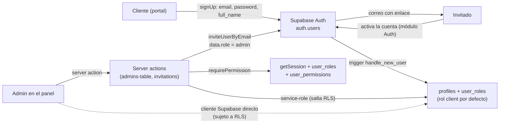

# Fase 1 — Diagnóstico NIST CSF 2.0 · Módulo Gestión de Usuarios

| Campo | Valor |
|---|---|
| Módulo | Gestión de Usuarios (`users`) |
| Responsable | Joseph (Daniel Salas) |
| Rama | `security/users/fase1-diagnostico` |
| Commit base analizado | `d68b50c` (`develop`, 2026-09-28) |
| Método | Análisis estático (lectura de código y migraciones). No se ejecutó la aplicación, ni pruebas, ni consultas contra la base de datos remota. |
| Estado | J1.1–J1.4 completos · listo para revisión (J1.5) |

---

## 1. Alcance

El módulo cubre el ciclo de vida de las cuentas administrativas y su modelo de privilegios: quién puede
entrar al panel, con qué rol (`owner` / `admin` / `client`) y con qué permisos finos, cómo se invita,
activa, desactiva y revoca a un administrador, y cómo se persiste todo esto en Supabase (tablas, RLS,
funciones y triggers).

| App / paquete | Rutas y features |
|---|---|
| `apps/panel-admin` (:3002) | `features/admins-table/**` (lista, permisos, activar/desactivar), `features/invitations/**` (invitar, reenviar, revocar), `app/admin/admins/**`, `app/admin/invitations/**`, `shared/auth/requirePermission.ts`, `shared/constants/permissions.ts`, `shared/components/PermissionGuard` |
| `packages/core` | `src/permissions/**` (`hasPermission`, `setUserPermissions`, …) y, del paquete `auth`, solo las funciones de aprovisionamiento de cuentas: `inviteAdminByEmail`, `createAdminAccount`, `completeAdminActivation` |
| `packages/db` | Migraciones: `create_users_table`, `users-table-policies`, `create_pending_invitations_table`, `fix_admin_invitations`, `add_owner_to_admin_policies`, `admins-permissions`, `seed_owner_permissions`, `migrate_admins_permissions`, `auto-assign-admin-basic-permissions`, `add_client_user_role`, `add_audit_view_permission` |

**Fuera de alcance (pertenece a otro módulo, solo se referencia):** login, sesión, cookies y
`middleware.ts` (Paula); tabla y API de auditoría (Fabian); políticas RLS de habitaciones y reservas
(Aarón).

---

## 2. J1.1 Inventario de activos

Escala C/I/D (Confidencialidad / Integridad / Disponibilidad): **A** alto · **M** medio · **B** bajo.

### 2.1 Activos de información (datos)

| ID | Activo | Ubicación | Contenido | C | I | D | Notas |
|---|---|---|---|---|---|---|---|
| US-D01 | Identidades de usuario | `auth.users` (gestionada por Supabase Auth) | Email, hash de contraseña, `raw_user_meta_data`, `raw_app_meta_data`, `last_sign_in_at` | **A** | **A** | A | `raw_user_meta_data` **es editable por el propio usuario** al registrarse; `raw_app_meta_data` no. Incluye a admins **y** a clientes del portal. |
| US-D02 | Perfiles | Tabla `profiles` (antes `users`) | `id`, `full_name`, `is_active` | M | **A** | M | `is_active` decide si un admin puede entrar. RLS con una única política (ver O7). |
| US-D03 | Roles | Tabla `user_roles` + enum `user_role` (`owner`, `admin`, `client`) | Un rol por usuario | M | **A** | M | RLS solo con lectura del propio rol; **sin políticas de escritura** (solo service-role y triggers escriben). No hay UI para cambiar roles. |
| US-D04 | Permisos finos | Tabla `user_permissions` + enum `user_permission` (14 valores, incl. `audit:view`) | `user_id`, `permission`, `granted_by`, `created_at` | M | **A** | M | Define qué puede hacer cada admin. Owner tiene todos por seed y además bypass por rol en la app. |
| US-D05 | Invitaciones | Tabla `pending_invitations` + enum `invitation_status` | `email`, `user_id`, `status`, `expires_at`, `invited_by`, `revoked_by`, fechas | M | M | B | `expires_at` es informativo: la caducidad real del enlace la controla Supabase Auth. |
| US-D06 | Tokens de invitación / activación | Enlace enviado por correo (Supabase `inviteUserByEmail`) | Token de un solo uso que permite fijar contraseña | **A** | **A** | B | Su ciclo de vida (validación, expiración) es del módulo de Autenticación. |
| US-D07 | PII de clientes registrados | `auth.users` + `profiles` con rol `client` | Nombre, email, teléfono (metadata) | **A** | M | M | Ley 8968. El permiso `clients:view` existe, pero **no hay pantalla de clientes** en el panel a esta fecha. |
| US-D08 | Sesión del administrador | Cookies de Supabase Auth (JWT + refresh token) | Identidad y rol de la sesión | **A** | **A** | M | Compartido con Autenticación. `requirePermission` la lee con `getSession()`. |
| US-D09 | Catálogo de permisos | Enum `user_permission` + `shared/constants/permissions.ts` | Nombres de los permisos y sus categorías | B | **A** | B | Agregar un permiso exige migración (`ALTER TYPE`) y código; un desajuste rompe la validación. |

### 2.2 Activos de software (componentes y endpoints)

Todas las funciones de `features/**/services` son *server actions* (`"use server"`): cada función
exportada es un endpoint invocable desde el navegador, no solo el código que hoy las llama.

| ID | Componente | Archivo | Tipo | Control de acceso actual |
|---|---|---|---|---|
| US-S01 | `createAdminAccountAction` | `invitations/services/createAdminAccountAction.ts:8` | Server action (crea cuenta admin) | **Ninguno** (no llama a `requirePermission`) |
| US-S02 | `inviteAdminByEmail` / `createAdminAccount` | `packages/core/src/auth/index.ts:199` / `:220` | Servicio con service-role | — (confía en quien lo llame) |
| US-S03 | `resendInvitation` | `invitations/services/resendInvitation.ts:10` | Server action | `requirePermission(admins:invite)` |
| US-S04 | `revokeInvitation` | `invitations/services/revokeInvitation.ts:7` | Server action (borra usuario de Auth) | `requirePermission(admins:revoke)` |
| US-S05 | `getPendingInvitations` / `getAllInvitations` | `invitations/services/*.ts` | Server actions de lectura | `requirePermission(admins:invite)` |
| US-S06 | `getAdmins` | `admins-table/services/getAdmins.ts:6` | Server action → RPC `get_admins` | `requirePermission(admins:view)` |
| US-S07 | `getUserPermissionsList` | `admins-table/services/permissions.ts:38` | Server action | `requirePermission(admins:view)` |
| US-S08 | `getUserPermissionsService` | `admins-table/services/permissions.ts:34` | Server action (lee permisos de **cualquier** `userId`) | **Ninguno** |
| US-S09 | `updateUserPermissions` | `admins-table/services/permissions.ts:90` | Server action (escribe permisos) | `requirePermission(permissions:manage)` + no auto-modificación + no tocar al owner |
| US-S10 | `toggleAdminStatus` | `admins-table/services/toggleAdminStatus.ts:9` | Server action (activa/desactiva) | `requirePermission(admins:disable)` |
| US-S11 | `@hotel/core/permissions` | `packages/core/src/permissions/index.ts` | `getUserPermissions`, `hasPermission`, `hasAllPermissions`, `hasAnyPermission`, `setUserPermissions` (service-role) | — (biblioteca interna) |
| US-S12 | `requirePermission` / `requirePermissions` | `shared/auth/requirePermission.ts:39` / `:54` | Guard de servidor; el owner pasa siempre | — |
| US-S13 | `PermissionGuard` y UI (`AdminsTable`, `PermissionDrawer`, tablas de invitaciones) | `shared/components/PermissionGuard`, `features/**/components` | Componentes cliente | Solo oculta elementos; **no es un control de seguridad** |
| US-S14 | Funciones y triggers de BD | `handle_new_user`, `handle_invitation_accepted`, `get_admins`, `is_admin_or_owner`, `has_permission`, `set_owner_permissions`, `set_admin_permissions`, triggers `on_auth_user_created`, `assign_owner_permissions`, `assign_admin_permissions` | SQL `SECURITY DEFINER` | Ver O2, O9 |
| US-S15 | Páginas `/admin/admins` y `/admin/invitations` | `app/admin/{admins,invitations}/page.tsx` | Server components | Guard vía `getAdmins` / `getPendingInvitations` → `forbidden()` |

### 2.3 Servicios externos e infraestructura

| ID | Servicio | Uso en el módulo | Observaciones |
|---|---|---|---|
| US-X01 | Supabase Auth | Alta de usuarios (`signUp`, `inviteUserByEmail`), API admin (`deleteUser`, `signOut`), emisión de JWT | La configuración de Auth (registro abierto, confirmación de correo, vigencia del enlace) **no está versionada en el repo**: por verificar. |
| US-X02 | Supabase Postgres / PostgREST | Tablas, RLS, funciones `SECURITY DEFINER`, RPC `get_admins` | Todo el esquema de `public` queda expuesto por PostgREST; la seguridad depende de RLS y de los `GRANT` de cada función. |
| US-X03 | `SUPABASE_SERVICE_ROLE_KEY` | Casi todos los servicios del módulo usan `createSupabaseServiceClient()` (salta RLS) | Solo debe existir en el servidor; el módulo depende de ella para casi toda operación. |
| US-X04 | Correo de invitación | Enviado por Supabase Auth al invitar o reenviar | Plantilla y SMTP se configuran en el dashboard, fuera del repo. |

### 2.4 Controles existentes (línea base preliminar, insumo para J1.4)

| Control | Dónde | Estado |
|---|---|---|
| Guard de permisos en el servidor | `requirePermission` en 8 de las 10 server actions del módulo | Parcial (faltan US-S01 y US-S08) |
| Owner con bypass y no modificable | `requirePermission` (`isOwner`) y `updateUserPermissions` (`OWNER_MODIFY`) | Existe, pero solo en ese action (no en `toggleAdminStatus`) |
| No auto-modificación de permisos | `updateUserPermissions`, `SELF_MODIFY` | Existe solo para permisos |
| Validación de permisos contra el enum | `updateUserPermissions` (líneas 128–132) | Existe |
| Aprovisionamiento de menor privilegio | Trigger `assign_admin_permissions`: un admin nuevo solo recibe `view:dashboard` y `reservations:view` | Existe |
| RLS habilitado en las 4 tablas del módulo | `profiles`, `user_roles`, `user_permissions`, `pending_invitations` | Existe (con debilidades, ver O7–O8) |
| Cierre de sesión al desactivar | `toggleAdminStatus:25` llama a `auth.admin.signOut(adminId)` | Dudoso (ver O5) |
| Middleware corta a cuentas con `is_active = false` | `apps/panel-admin/src/middleware.ts` (módulo de Paula) | Existe |
| Constraints e integridad relacional | PK compuesta `(user_id, permission)`, FK con `ON DELETE CASCADE`, enums para rol, permiso y estado | Existe |
| Escape de salida por defecto | React renderiza `full_name` y `email` como texto; no hay `dangerouslySetInnerHTML` en el módulo | Existe |

---

## 3. Observaciones preliminares (candidatas para la Fase 2 — sin confirmar)

Superficies detectadas leyendo el código. Cada una se confirma o descarta con una PoC en la Fase 2.
Las marcadas **(por verificar)** dependen de configuración o de privilegios de la base remota que este
análisis estático no puede comprobar.

| # | Observación | Evidencia (archivo:línea) | Vector / OWASP tentativo |
|---|---|---|---|
| O1 | `createAdminAccountAction` no llama a `requirePermission(admins:invite)` y termina en `createAdminAccount` con service-role: cualquier sesión que alcance la action puede crear cuentas de administrador. La validación de nombre/email es solo de UI (`CreateAdminForm`). Además, el rol `admin` solo se asigna si `full_name` viene no vacío (`if (full_name)`), y el error `EMAIL_ALREADY_INVITED` está tipado pero nunca se devuelve. | `createAdminAccountAction.ts:8-25`, `core/auth/index.ts:208-209`, `:220-235` | V1 · A01 |
| O2 | El trigger `handle_new_user` toma el rol de `raw_app_meta_data ->> 'role'` y, si no existe, de `raw_user_meta_data ->> 'role'`. Este último lo controla quien se registra: alguien que llame directamente a la API de Auth de Supabase con `data: {"role": "owner"}` podría obtener rol `owner`, y el trigger `assign_owner_permissions` le concede los 13 permisos. El flujo de invitación también depende de ese campo (`options.data = { role: "admin" }`). **(por verificar** que el registro público esté habilitado). | `20260512000002_users-table-policies.sql:57-65`, `20260525012253_seed_owner_permissions.sql:29-48`, `core/auth/index.ts:209` | V1 · A01 · confianza en metadata del usuario (coordinar con Paula) |
| O3 | `getUserPermissionsService(userId)` está en un archivo `"use server"` y no tiene guard: devuelve los permisos de cualquier usuario a cualquier sesión que la invoque (IDOR de lectura). | `admins-table/services/permissions.ts:34-36` | V1 · A01 |
| O4 | `updateUserPermissions` no comprueba que el destino sea un administrador (acepta cualquier `userId`, incl. clientes), no limita la delegación (un admin con `permissions:manage` puede otorgar `permissions:manage` y cualquier permiso que él no tenga) y el reemplazo es no atómico (upsert y luego delete). Toma la sesión con `getSession()`. | `permissions.ts:90-140`, `core/permissions/index.ts:126-164`, `requirePermission.ts:14-17` | V1 · A01 · V3 · A08 |
| O5 | `toggleAdminStatus` no impide desactivar al owner ni a uno mismo, y el nuevo estado sale de un parámetro que envía el cliente (`update({ is_active: !isActive })`). Además, `auth.admin.signOut(adminId)` recibe un UUID, pero la API de Supabase espera el **JWT** de acceso: la revocación de sesiones podría no ocurrir **(por verificar)**. | `toggleAdminStatus.ts:13-25`, `useToggleAdminStatus.ts:12` | V3 · A08 / V1 · A01 |
| O6 | `revokeInvitation` solo rechaza el estado `revoked`: permite revocar una invitación `accepted`, y `auth.admin.deleteUser` elimina la cuenta activa del admin (con `CASCADE` se borran su perfil, rol y permisos). Actualiza el estado aunque `deleteUser` falle. `resendInvitation` solo bloquea `expired`, estado que nunca se persiste (se calcula en `getStatusInfo.ts:21`), y por tanto reenvía sobre invitaciones `accepted` o `revoked`. | `revokeInvitation.ts:22-34`, `resendInvitation.ts:25-33` | V3 · A08 (manipulación de parámetros / estado) |
| O7 | La política RLS `"Admins can read other users"` de `profiles` se creó **sin `FOR SELECT`**, por lo que aplica a `ALL`: cualquier admin/owner puede insertar, actualizar o borrar filas de `profiles` (p. ej. `is_active` de otros) usando su propia sesión contra PostgREST, sin `admins:disable`. Igual en `pending_invitations`: las políticas de insert/update solo piden ser `admin`/`owner`, no el permiso `admins:invite`/`admins:revoke`. | `20260524000000_add_owner_to_admin_policies.sql:37-45`, `:58-68` | V1 · A01 |
| O8 | Las políticas de `user_permissions` permiten `INSERT` y `DELETE` a cualquier admin con `permissions:manage` sin restringir el usuario destino: puede agregarse permisos a sí mismo o borrar filas del owner desde el cliente de Supabase, saltándose `SELF_MODIFY` y `OWNER_MODIFY` (que existen solo en la server action). | `20260525012252_admins-permissions.sql:76-90` | V1 · A01 |
| O9 | `get_admins()` es `SECURITY DEFINER` y no hay ningún `REVOKE`/`GRANT` en las migraciones: por defecto Supabase concede `EXECUTE` a `anon`/`authenticated`. Si es así, `/rest/v1/rpc/get_admins` devolvería id, email, nombre y rol de todos los administradores a cualquiera. **(por verificar con la BD).** | `20260524000000_add_owner_to_admin_policies.sql:5-31` | V1 · A01 · exposición de PII |
| O10 | Ninguna operación del módulo genera eventos de auditoría (invitar, reenviar, revocar, activar/desactivar, cambiar permisos). `logAuditEvent` solo se usa en el login y en `getAuditLogs`. Tampoco se registran los intentos denegados. | búsqueda de `logAuditEvent` en `apps/panel-admin/src` | Detect (DE.CM) · insumo para J3.4 con la API de Fabian |
| O11 | `full_name` y `email` se muestran como texto en `AdminsTable` (React escapa). No hay `dangerouslySetInnerHTML` en el módulo, pero `full_name` entra sin límites de longitud ni de caracteres (`createAdminAccountAction` solo hace `trim`) y también lo fija cada cliente al registrarse en el portal. El visor de auditoría (Fabian) **sí** usa `dangerouslySetInnerHTML`: si estos datos llegan a sus metadatos, hay un vector de XSS cruzado. | `AdminsTable.tsx:50-51`, `createAdminAccountAction.ts:12-13`, `audit-log/.../AuditLogDetailDrawer.tsx` | V2 · A03 (XSS): probablemente requiera vulnerabilidad **introducida** en este módulo |
| O12 | `requirePermission` usa `auth.getSession()` (lee el JWT de la cookie sin revalidarlo con el servidor de Auth; el middleware sí usa `getUser()`) y no comprueba `is_active`: depende del middleware. | `requirePermission.ts:10-24`, `:39-52` | V1 · A01 (coordinar con Paula) |
| O13 | No hay sinks de inyección evidentes: el filtrado de la tabla de admins es 100 % cliente sobre una lista ya cargada (`useAdminsFiltering`) y el acceso a datos usa el query builder. Único punto a vigilar: `setUserPermissions` arma el filtro `not in (${lista})` con un string; hoy la lista viene validada contra el enum en el action, pero la función de `core` es exportable y no valida. | `useAdminsFiltering.ts`, `core/permissions/index.ts:153-158` | V1 · A03: probablemente requiera vulnerabilidad **introducida** |

---

## 4. J1.2 Mapeo de componentes contra NIST CSF 2.0

Estados: **Cumple** · **Parcial** · **No cumple** · **Por verificar** (requiere PoC o consulta a la BD).

### 4.1 Flujo de datos del módulo (ID.AM-03)

Puntos donde un dato cruza una frontera de confianza:

1. **Registro público → `auth.users` → trigger:** el trigger deriva el rol a partir de metadata que controla el usuario (O2).
2. **Navegador → server action:** cada función exportada es invocable; la autorización debe ocurrir dentro de la función (O1, O3).
3. **Server action → BD con service-role:** RLS no protege; el único control es `requirePermission` y las reglas de negocio de cada action (O4, O5, O6).
4. **Navegador → PostgREST con la sesión del admin:** aquí sí aplica RLS, y sus políticas son más permisivas que la lógica de las actions (O7, O8, O9).

### 4.2 Mapeo por componente

#### Aprovisionamiento — invitaciones

| Componente | Función | Subcategoría NIST CSF 2.0 | Por qué aplica | Estado | Ref. |
|---|---|---|---|---|---|
| US-S01 `createAdminAccountAction` | PROTECT | **PR.AA-05** Permisos de acceso gestionados con menor privilegio y separación de funciones | Crea cuentas de administrador sin comprobar `admins:invite` | No cumple | O1 |
| | PROTECT | **PR.DS-10** Datos en uso protegidos (integridad de la entrada) | Nombre y email solo se validan en la UI; el servidor hace `trim` | No cumple | O1, O11 |
| US-S02 `inviteAdminByEmail` / `createAdminAccount` | PROTECT | **PR.AA-05** | El rol se envía en `options.data` (metadata editable) y no en `app_metadata` ni en la tabla de roles | No cumple | O2 |
| | IDENTIFY | **ID.AM-08** Sistemas y datos gestionados durante su ciclo de vida | Si falla el insert en `pending_invitations` solo hay `console.error`: queda una cuenta invitada sin registro | Parcial | O1 |
| US-S03 `resendInvitation` | PROTECT | **PR.AA-05** | `requirePermission(admins:invite)` en el servidor | Cumple | — |
| | PROTECT | **PR.DS-10** | No valida el estado: reenvía sobre `accepted` o `revoked`; `expired` nunca se persiste | No cumple | O6 |
| US-S04 `revokeInvitation` | PROTECT | **PR.AA-05** | `requirePermission(admins:revoke)` en el servidor | Cumple | — |
| | PROTECT | **PR.DS-10** | Acepta revocar una invitación `accepted` y borra la cuenta activa del admin | No cumple | O6 |
| US-S05 lecturas de invitaciones | PROTECT | **PR.AA-05** | `requirePermission(admins:invite)` | Cumple | — |
| Las tres operaciones anteriores | DETECT | **DE.CM-03** Actividad del personal y uso de tecnología monitoreados | Invitar, reenviar y revocar no dejan rastro | No cumple | O10 |

#### Administración de administradores y permisos

| Componente | Función | Subcategoría NIST CSF 2.0 | Por qué aplica | Estado | Ref. |
|---|---|---|---|---|---|
| US-S06 `getAdmins` | PROTECT | **PR.AA-05** | `requirePermission(admins:view)` | Cumple | — |
| | PROTECT | **PR.DS-01** Datos en reposo protegidos | Llama a `get_admins()`, función `SECURITY DEFINER` sin `GRANT` explícito | Por verificar | O9 |
| US-S07 `getUserPermissionsList` | PROTECT | **PR.AA-05** | `requirePermission(admins:view)` | Cumple | — |
| US-S08 `getUserPermissionsService` | PROTECT | **PR.AA-05** | Devuelve los permisos de cualquier `userId` sin guard | No cumple | O3 |
| US-S09 `updateUserPermissions` | PROTECT | **PR.AA-05** | Guard `permissions:manage`, sin auto-modificación y sin tocar al owner; falta validar que el destino sea admin y limitar la delegación | Parcial | O4 |
| | PROTECT | **PR.DS-10** | Valida cada permiso contra el enum antes de escribir | Cumple | — |
| | PROTECT | **PR.DS-01** | El reemplazo de permisos no es atómico (upsert y luego delete) | Parcial | O4 |
| | DETECT | **DE.CM-03** | Los cambios de permisos no se auditan | No cumple | O10 |
| US-S10 `toggleAdminStatus` | PROTECT | **PR.AA-05** | Guard `admins:disable`, pero acepta cualquier destino (owner, uno mismo) | Parcial | O5 |
| | PROTECT | **PR.DS-10** | El nuevo estado sale de un parámetro que envía el cliente | No cumple | O5 |
| | PROTECT | **PR.AA-01** Identidades y credenciales gestionadas | Revocar sesiones al desactivar depende de `auth.admin.signOut(adminId)`, que espera un JWT | Por verificar | O5 |
| | DETECT | **DE.CM-03** | Activar/desactivar cuentas no se audita | No cumple | O10 |
| US-S13 UI (`AdminsTable`, `PermissionDrawer`) | PROTECT | **PR.DS-10** | React escapa `full_name` y `email`; no hay `dangerouslySetInnerHTML` | Cumple | O11 |
| | PROTECT | **PR.PS-01** Gestión de configuración | El panel no define CSP (defensa en profundidad ante XSS) | No cumple | O11 |
| US-S15 páginas `/admin/admins` y `/admin/invitations` | PROTECT | **PR.AA-05** | Dependen de `getAdmins` y `getPendingInvitations`; si fallan por permiso llaman a `forbidden()` | Cumple | — |

#### Guard de permisos y biblioteca `core`

| Componente | Función | Subcategoría NIST CSF 2.0 | Por qué aplica | Estado | Ref. |
|---|---|---|---|---|---|
| US-S12 `requirePermission(s)` | PROTECT | **PR.AA-05** | Comprueba rol owner o permiso en el servidor, no en la UI | Cumple | — |
| | PROTECT | **PR.AA-04** Aserciones de identidad protegidas y verificadas | Obtiene el usuario con `getSession()` (JWT de la cookie sin revalidar) | Parcial | O12 |
| | PROTECT | **PR.AA-01** | No verifica `is_active`: una cuenta desactivada depende de que el middleware la corte | Parcial | O12 |
| US-S11 `@hotel/core/permissions` | PROTECT | **PR.AA-05** | `hasPermission`, `hasAllPermissions` y `hasAnyPermission` con bypass de owner | Cumple | — |
| | PROTECT | **PR.DS-10** | `setUserPermissions` no valida el contenido de la lista y la interpola en el filtro `not in` | Parcial | O13 |

#### Base de datos (RLS, funciones y triggers)

| Componente | Función | Subcategoría NIST CSF 2.0 | Por qué aplica | Estado | Ref. |
|---|---|---|---|---|---|
| US-D02 `profiles` | PROTECT | **PR.AA-05** | Política sin `FOR SELECT`: aplica a ALL, cualquier admin/owner puede escribir perfiles | No cumple | O7 |
| US-D03 `user_roles` | PROTECT | **PR.AA-05** | Solo lectura del propio rol y sin políticas de escritura (solo service-role y triggers) | Cumple | — |
| US-D04 `user_permissions` | PROTECT | **PR.AA-05** | `INSERT`/`DELETE` para cualquier admin con `permissions:manage`, sin restringir el destino | No cumple | O8 |
| US-D05 `pending_invitations` | PROTECT | **PR.AA-05** | Políticas por rol (`admin`/`owner`), no por permiso (`admins:invite`, `admins:revoke`) | No cumple | O7 |
| US-S14 `handle_new_user` | PROTECT | **PR.AA-04** | El rol se deriva de `raw_user_meta_data`, campo que controla el usuario | No cumple | O2 |
| | PROTECT | **PR.AA-05** | Un admin nuevo solo recibe `view:dashboard` y `reservations:view` (`set_admin_permissions`) | Cumple | — |
| US-S14 funciones `SECURITY DEFINER` | PROTECT | **PR.PS-06** Prácticas de desarrollo seguro | Las funciones del módulo fijan `SET search_path = ''` | Cumple | — |
| Enums, PK y FK | PROTECT | **PR.DS-01** | Rol, permiso y estado son enums; PK `(user_id, permission)`; FK con `ON DELETE CASCADE` | Cumple | — |
| Tablas del módulo | DETECT | **PR.PS-04** Registros generados y disponibles para monitoreo | No hay triggers ni tabla de auditoría alimentada por cambios de rol, permiso o perfil | No cumple | O10 |

#### Transversal (compartido con otros módulos)

| Componente | Función | Subcategoría NIST CSF 2.0 | Por qué aplica | Estado | Ref. |
|---|---|---|---|---|---|
| `middleware.ts` del panel (Paula) | PROTECT | **PR.AA-05** | Exige sesión y `is_active`, pero no el rol: una sesión válida de cliente pasa el middleware | Parcial | Operaciones O2 |
| Servicio `logAuditEvent` (Fabian) | DETECT | **DE.AE-02** Eventos adversos potenciales analizados | Los intentos denegados (`PermissionDeniedError`, `SELF_MODIFY`, `OWNER_MODIFY`) no se registran | No cumple | O10 |
| Proceso de gestión de accesos | PROTECT | **PR.AA-05** | No existe revisión periódica de permisos ni de cuentas inactivas (la subcategoría exige que sean "revisados") | No cumple | — |
| Modelo de roles | GOVERN | **GV.RR-02** Roles, responsabilidades y autoridades establecidos | Los roles están definidos en el enum, pero las reglas de delegación no están documentadas | Parcial | O4 |
| Hallazgos del módulo | IDENTIFY | **ID.RA-01** Vulnerabilidades identificadas, validadas y registradas | 13 observaciones candidatas registradas en §3 | En curso | §3 |

### 4.3 Resumen de cobertura por subcategoría

| Subcategoría | Componentes evaluados | Cumple | Parcial | No cumple | Por verificar |
|---|---|---|---|---|---|
| PR.AA-01 | 2 | 0 | 1 | 0 | 1 |
| PR.AA-04 | 2 | 0 | 1 | 1 | 0 |
| PR.AA-05 | 20 | 10 | 3 | 7 | 0 |
| PR.DS-01 | 3 | 1 | 1 | 0 | 1 |
| PR.DS-10 | 7 | 2 | 1 | 4 | 0 |
| PR.PS-01/04/06 | 3 | 1 | 0 | 2 | 0 |
| DE.CM-03 / DE.AE-02 | 4 | 0 | 0 | 4 | 0 |
| ID.AM-08, GV.RR-02 | 2 | 0 | 2 | 0 | 0 |
| **Total** | **43** | **14** | **9** | **18** | **2** |

**Lectura:** la autorización *dentro de las server actions* está mayormente bien resuelta (8 de 10 con
guard y el owner protegido en el action de permisos). Los problemas están en tres capas que el guard no
cubre: (1) **el origen del rol**, que se deriva de metadata editable del usuario; (2) **las políticas RLS**,
más permisivas que la lógica de la aplicación, de modo que un admin con su propia sesión puede saltarse las
actions; y (3) **las reglas de negocio de destino** (a quién se puede desactivar, revocar o delegar).
**DETECT es nulo:** ninguna operación de gestión de usuarios deja rastro de auditoría.

---

## 5. J1.3 Impacto operacional y de negocio (GOVERN / IDENTIFY)

### 5.1 Contexto organizacional (GV.OC)

| Subcategoría | Aplicación al módulo |
|---|---|
| **GV.OC-01** Misión | El módulo decide **quién puede operar el hotel desde el panel**: reservas con datos de huéspedes, tarifas, habitaciones y contenido público. No genera ingresos por sí mismo, pero es la base de la autorización de todo el sistema: si falla, ningún otro control tiene sentido. |
| **GV.OC-02** Partes interesadas | **Owner** (dueño del riesgo, único con bypass total), **administradores / recepción** (sus cuentas y permisos), **clientes** (tienen cuenta con PII en la misma Auth), **Supabase** (proveedor de Auth y BD) y el **equipo de desarrollo**. |
| **GV.OC-03** Requisitos legales y contractuales | **Ley 8968** de Protección de la Persona frente al Tratamiento de sus Datos Personales (CR): nombre, email y teléfono de personal y clientes. Aplica también el deber de poder **atribuir accesos y cambios de privilegios** (rastro de auditoría) ante un incidente de datos. Términos de Supabase (custodia de la service-role key). |
| **GV.OC-04** Servicios críticos que dependen del módulo | Acceso al panel, gestión de reservas (permisos `reservations_*`), habitaciones (`rooms_manage`), CMS (`cms_manage`), alta y baja de personal. |
| **GV.OC-05** Dependencias del módulo | **Supabase** (Auth y Postgres: sin ellos no hay cuentas ni permisos), módulo de **Autenticación** (login, middleware, tokens de activación), módulo de **Auditoría** (API `logAuditEvent` para DETECT) y módulo de **Operaciones** (consume `rooms_manage`/`reservations_*` y tiene RLS que depende del rol). |

### 5.2 Roles y apetito de riesgo (GV.RR / GV.RM)

- **Dueño del riesgo del módulo:** el owner del hotel. **Responsable técnico:** Joseph.
- **GV.RR-02 Roles y autoridades:** `owner` (único; todos los permisos y no modificable desde la app), `admin` (solo los permisos que se le asignen) y `client` (sin acceso al panel). Las reglas de delegación (quién puede otorgar qué) **no están documentadas** y hoy las define el código de `updateUserPermissions`.
- **GV.RM-02 Apetito de riesgo propuesto:**
  - **Tolerancia cero** a que alguien obtenga un rol o permiso que no se le asignó, y a que se creen cuentas privilegiadas sin autorización.
  - **Tolerancia cero** a que una cuenta desactivada o revocada conserve acceso.
  - **Tolerancia muy baja** a la exposición de datos personales de personal y clientes.
  - **Tolerancia moderada** a una indisponibilidad breve de la gestión de cuentas (los administradores ya activos siguen operando).

### 5.3 Análisis de impacto por proceso de negocio

| Proceso | Activos | Pérdida de C | Pérdida de I | Pérdida de D | Impacto dominante |
|---|---|---|---|---|---|
| **P1. Alta y baja de personal administrativo** (invitar, activar, revocar, desactivar) | US-D01, D05, D06, US-S01–S05, S10 | Media: emails de personal y enlaces de invitación | **Crítica**: una cuenta admin no autorizada accede a reservas con PII y a tarifas; una baja que no se aplica deja acceso a un ex-empleado | Baja: el hotel opera unos días sin altas nuevas | Integridad |
| **P2. Asignación de permisos (RBAC)** | US-D03, D04, US-S07–S09, S11, S12 | Media: conocer la estructura de privilegios facilita ataques dirigidos | **Crítica**: una elevación de privilegios vuelve alcanzables todas las demás funciones del panel | Media: permisos mal escritos dejan a un admin sin acceso | Integridad |
| **P3. Autorización de cada petición al panel** (`requirePermission`, RLS) | US-S12, políticas RLS | **Alta**: detrás de cada permiso hay PII de huéspedes | **Alta**: un guard ausente equivale a permiso concedido a cualquiera | Media: si el guard falla cerrado, el panel deja de operar | Confidencialidad e integridad |
| **P4. Registro de clientes y rol inicial** (`handle_new_user`) | US-D01, D03, D07, US-S14 | Media: PII de clientes | **Crítica**: es el único punto donde nace un rol sin intervención de un admin | **Alta**: si el trigger falla, nadie puede registrarse en el portal | Integridad |
| **P5. Trazabilidad de la gestión de accesos** | Ausente (O10) | — | **Alta**: sin rastro no se atribuye un abuso de privilegios ni se reconstruye un incidente (no repudio) | — | Detección |

### 5.4 Escala de valoración

Se usa **la misma escala del módulo de Operaciones** para que las filas de la Matriz General de Gobernanza
(G1) sean comparables entre módulos.

| Nivel | Impacto (I) | Probabilidad (P) |
|---|---|---|
| 1 | **Bajo:** molestia, sin pérdida económica ni de datos | **Rara:** exige acceso privilegiado y una cadena compleja |
| 2 | **Medio:** pérdida económica acotada o afectación operativa de horas | **Posible:** exige cuenta con permisos o condiciones específicas |
| 3 | **Alto:** pérdida económica directa, afectación a varias personas o incumplimiento legal puntual | **Probable:** explotable con cualquier cuenta autenticada (el registro de clientes es abierto) |
| 4 | **Crítico:** control total del sistema, filtración masiva de PII, sanción o daño reputacional severo | **Casi segura:** anónimo, trivial, sin cuenta |

**Riesgo inherente = I × P:** 1–3 **Bajo** · 4–6 **Medio** · 8–9 **Alto** · 12–16 **Crítico**.
"Inherente" = riesgo del código en `d68b50c`, antes de los parches de la Fase 3, considerando los
controles que ya existen (§2.4). En la Fase 3 se recalcula como riesgo residual.

### 5.5 Escenarios de riesgo y riesgo inherente (ID.RA-03/04/05)

| ID | Escenario de amenaza | Activo | Ref. | I | P | Riesgo inherente | Justificación |
|---|---|---|---|---|---|---|---|
| **US-R01** | Un usuario se registra llamando directamente a la API de Auth con `data: {"role": "owner"}` y el trigger le asigna rol `owner` y todos los permisos | US-D01, D03, US-S14 | O2 | 4 | 3 | **Crítico (12)** *(provisional)* | Control total: crear y desactivar admins, ver PII, cambiar tarifas. El registro es abierto y la escalada ocurre en la BD, no en la app. **Provisional:** baja a Alto (8) si la PoC J2.1 muestra que el registro público está deshabilitado o que el campo no llega a `user_roles`. |
| **US-R02** | Una sesión sin `admins:invite` (p. ej. un admin con solo `view:dashboard`) invoca `createAdminAccountAction` y crea cuentas de administrador | US-S01, S02 | O1 | 4 | 2 | **Alto (8)** | La cuenta nueva entra al panel con permisos básicos y sirve para pivotar. P=2: exige una sesión válida en el panel. |
| **US-R03** | Cambios de permisos, altas, bajas y revocaciones se hacen sin dejar rastro y no pueden atribuirse ni detectarse | Todos | O10 | 3 | 3 | **Alto (9)** | Sin auditoría no hay no repudio ni detección de abuso de privilegios; incumple todo DE.CM del módulo. Mismo criterio que OP-R04. |
| **US-R04** | Un admin salta las server actions y escribe directo en `profiles`, `user_permissions` o `pending_invitations` desde el cliente de Supabase (desactivar al owner, otorgarse permisos, forjar invitaciones) | US-D02, D04, D05 | O7, O8 | 3 | 2 | **Medio (6)** | Exige ser admin. Un admin sin `permissions:manage` no puede otorgarse permisos, pero sí desactivar cuentas, incluida la del owner. |
| **US-R05** | Un admin con `permissions:manage` otorga cualquier permiso (incl. `permissions:manage`) a otro admin o a un cliente y crea un privilegio casi equivalente a owner | US-S09, US-D04 | O4 | 3 | 2 | **Medio (6)** | Exige un permiso sensible legítimo (amenaza interna o cuenta comprometida). |
| **US-R06** | Se revoca una invitación ya aceptada y se elimina la cuenta de un admin activo; se reenvían invitaciones sobre estados inválidos | US-S03, S04 | O6 | 3 | 2 | **Medio (6)** | Pérdida de la cuenta y de sus permisos (`CASCADE`). Exige `admins:revoke`. |
| **US-R07** | Se desactiva al owner o a uno mismo, o la sesión de una cuenta desactivada sigue viva | US-S10 | O5 | 3 | 2 | **Medio (6)** | Exige `admins:disable`. El middleware corta `/admin` por `is_active`, lo que acota el efecto de la sesión viva. |
| **US-R08** | Lectura no autorizada de los permisos de cualquier usuario y del listado de administradores (RPC `get_admins` público) | US-S08, US-S06, US-S14 | O3, O9 | 2 | 3 | **Medio (6)** | Emails y estructura de privilegios facilitan ataques dirigidos. P sube a 4 si O9 se confirma para `anon`. |
| **US-R09** | XSS almacenado a través de `full_name` o `email` mostrados en tablas y drawers, o en el visor de auditoría | US-D02, US-S13 | O11 | 3 | 1 | **Bajo (3)** | React escapa por defecto y no hay `dangerouslySetInnerHTML` en el módulo. Sube si el visor de auditoría (Fabian) renderiza HTML con estos datos. |
| **US-R10** | Filtración de `SUPABASE_SERVICE_ROLE_KEY` | US-X03 | — | 4 | 1 | **Medio (4)** | Casi todo el módulo la usa y salta RLS. Solo se usa en el servidor y no está en el repo. |
| **US-R11** | Lista de permisos manipulada en `setUserPermissions` (interpolación en el filtro) o permisos inconsistentes por el reemplazo no atómico | US-S11, US-S09 | O4, O13 | 2 | 1 | **Bajo (2)** | Hoy la lista se valida contra el enum antes de llegar; queda como defensa en profundidad. |

### 5.6 Resumen de impacto

- **1 riesgo Crítico** (US-R01, provisional), **2 Altos** (US-R02, US-R03), **6 Medios** (US-R04 a R08 y R10) y
  **2 Bajos** (US-R09, R11).
- **El proceso más expuesto es P4 (registro y rol inicial)**, porque el rol nace de un campo controlado por el
  usuario, y **P1 (alta de personal)**, porque crear una cuenta admin no exige el permiso correspondiente.
- **El control ausente de mayor efecto transversal es la auditoría (US-R03):** sube la probabilidad efectiva
  de todos los demás escenarios porque nada se detecta.
- **Prioridad para la Fase 2:**
  1. US-R01 (vector 1; coordinar con Paula, dueña del flujo de Auth y de sus triggers).
  2. US-R02 y US-R04 (vector 1: control de acceso y RLS).
  3. US-R05, US-R06 y US-R07 (vector 3: manipulación de parámetros y de estado). Al probar CSRF conviene
     comprobar primero qué protección ofrecen por defecto las server actions de Next.js (verificación de `Origin`).
  4. US-R09 (vector 2; probablemente con una vulnerabilidad **introducida**, §4.1 del plan).
  5. US-R03 (log injection y audit poisoning, con Fabian).

---

## 6. J1.4 Línea base de controles PROTECT / DETECT

La línea base es el **mínimo de controles** que el módulo debe cumplir para que cada riesgo de §5.5 quede
en Bajo o Medio. "Estado actual" es el punto de partida de la Fase 3; "Tarea" enlaza con el checklist
J3.x del plan. Todos los controles se resuelven con **código propio o funciones ya incluidas en el stack**
(Zod, RLS y funciones SQL de Postgres, API admin de Supabase, `logAuditEvent`): ninguno requiere
herramientas de pago.

### 6.1 Controles PROTECT

| ID | Control requerido (línea base) | Subcategoría | Riesgos | Estado actual | Brecha | Tarea | Coordinar con |
|---|---|---|---|---|---|---|---|
| **US-C01** | **Autorización en el servidor en cada server action**: `requirePermission(admins_invite)` en `createAdminAccountAction` y `requirePermission(permissions_manage)` en `getUserPermissionsService` | PR.AA-05 | R02, R08 | **Parcial**: 8 de 10 actions con guard | 2 actions sin guard (O1, O3) | J3.1 | — |
| **US-C02** | **El rol nunca se deriva de metadata editable por el usuario**: `handle_new_user` ignora `raw_user_meta_data ->> 'role'` (rol `client` por defecto) y el rol de una invitación lo fija el servidor (`app_metadata` o actualización de `user_roles` con service-role) | PR.AA-05, PR.AA-04 | R01, R02 | **No cumple** | Cualquier registro puede declarar su rol (O2) | J3.1 | **Paula** (trigger de Auth y flujo de invitación/activación) |
| **US-C03** | **RLS de menor privilegio con `FOR` explícito y `WITH CHECK`**: `profiles` (lectura para admin, sin escritura para `authenticated`), `pending_invitations` (por permiso con `has_permission`, no solo por rol), `user_permissions` (sin auto-otorgamiento ni destino owner); reemplazo de permisos en una sola operación atómica (función SQL) | PR.AA-05, PR.DS-01 | R04, R05, R11 | **No cumple** | Políticas más permisivas que la lógica de las actions (O7, O8) | J3.1 | Aarón (patrón común `has_permission` / `is_admin_or_owner`) |
| **US-C04** | **Validación con esquema en cada frontera (Zod)**: email, `full_name` (longitud y caracteres), UUID de destino, permisos ∈ enum; el estado destino de `toggleAdminStatus` se calcula en el servidor y no viene del cliente | PR.DS-10, PR.PS-06 | R02, R05, R07, R11 | **No cumple**: solo validación de UI y el check del enum en un action | Sin validación en runtime en el servidor (O1, O5, O13) | J3.3 | — |
| **US-C05** | **Reglas de negocio sobre el destino y la delegación**: el destino debe ser un admin activo; no tocar al owner ni a uno mismo (toggle, revocar); solo el owner otorga `permissions:manage`; nadie otorga permisos que no posee | PR.AA-05, GV.RR-02 | R05, R06, R07 | **Parcial**: `SELF_MODIFY` y `OWNER_MODIFY` solo en `updateUserPermissions` | `toggleAdminStatus` y `revokeInvitation` sin restricciones; delegación sin límite (O4, O5) | J3.1 / J3.3 | — |
| **US-C06** | **Máquina de estados de invitaciones**: revocar y reenviar solo desde `pending`; `expired` calculado en un único lugar; revocar nunca elimina una cuenta `accepted`; el orden `deleteUser` / `update` es consistente | PR.DS-10, ID.AM-08 | R06 | **No cumple** | Se puede revocar una invitación aceptada y borrar la cuenta (O6) | J3.3 | — |
| **US-C07** | **Revocación efectiva de acceso al desactivar**: invalidar la sesión con el mecanismo correcto de Supabase (JWT de la sesión o `ban_duration` con `auth.admin.updateUserById`) y comprobar `is_active` también en `requirePermission` | PR.AA-01 | R07 | **Parcial**: el middleware corta `/admin`; `signOut(adminId)` dudoso | La sesión de una cuenta desactivada podría seguir viva (O5, O12) | J3.3 | **Paula** (middleware y guard) |
| **US-C08** | **Funciones `SECURITY DEFINER` sin ejecución pública**: `REVOKE EXECUTE … FROM PUBLIC, anon, authenticated` en `get_admins` (solo service-role) o comprobación interna con `is_admin_or_owner()` y permiso | PR.AA-05, PR.DS-01 | R08 | **Por verificar** | Sin `GRANT`/`REVOKE` explícito en las migraciones (O9) | J3.1 | — |
| **US-C09** | **Identidad verificada en el servidor**: `requirePermission` obtiene el usuario con `getUser()` (validado por Auth) y no con `getSession()` | PR.AA-04 | R01, R02 | **Parcial**: el middleware usa `getUser()`, el guard no | El guard confía en el JWT de la cookie (O12) | J3.1 | **Paula** |
| **US-C10** | **Escape de salida, límites al texto libre y CSP**: longitud máxima y caracteres permitidos en `full_name` y `email`; CSP que bloquee scripts inline | PR.DS-10, PR.PS-01 | R09 | **Parcial**: React escapa por defecto; **sin CSP** | Sin límites de longitud/formato ni CSP (O11) | J3.2 | **Paula** (CSP global), Fabian (visor de auditoría) |
| **US-C11** | **Menor uso de service-role y módulos `server-only`**: usar el cliente de sesión con RLS correcta donde sea posible; marcar como `server-only` lo que use la service-role; documentar `SUPABASE_SERVICE_ROLE_KEY` en `.env.example` | PR.PS-01, PR.AA-05 | R10 | **Parcial**: la clave solo se usa en el servidor | Uso casi total de service-role en el módulo | J3.1 | — |
| **US-C12** | **Integridad relacional y de dominio en BD** (enums, PK compuesta, FK con `ON DELETE CASCADE`) | PR.DS-01 | R11 | **Cumple** | — | Mantener; test de regresión | — |
| **US-C13** | **Aprovisionamiento por defecto de menor privilegio**: admin nuevo con `view:dashboard` y `reservations:view`; owner único con seed | PR.AA-05 | R05 | **Cumple** | — | Mantener; test de regresión | — |

### 6.2 Controles DETECT

| ID | Control requerido (línea base) | Subcategoría | Riesgos | Estado actual | Brecha | Tarea | Coordinar con |
|---|---|---|---|---|---|---|---|
| **US-C14** | **Auditoría de la gestión de usuarios** vía `logAuditEvent`, con actor, destino, valor antes/después y campos saneados. Eventos mínimos: `admin.invited`, `admin.invitation_resent`, `admin.invitation_revoked`, `admin.status_changed`, `permissions.updated` | PR.PS-04, DE.CM-03 | R03 (soporta R02, R05, R06, R07) | **No cumple**: ninguna operación del módulo se registra | Sin no repudio ni trazabilidad (O10) | J3.4 | **Fabian** (nuevos `AUDIT_ACTIONS` y guía de uso) |
| **US-C15** | **Registro de intentos denegados y entradas rechazadas** (`PermissionDeniedError`, `SELF_MODIFY`, `OWNER_MODIFY`, fallos de esquema) | DE.CM-03, DE.AE-02 | R02, R04, R08 | **No cumple** | Los sondeos y abusos son invisibles | J3.4 | Fabian |
| **US-C16** | **Detección de cambios de privilegio hechos fuera de la app**: trigger de BD sobre `user_roles`, `user_permissions` y `profiles.is_active` que registre el cambio en `audit_logs` | DE.CM-09 | R01, R04 | **No cumple** | Un cambio directo por PostgREST o SQL no deja rastro | J3.4 (si el tiempo lo permite) | Fabian (escritura en `audit_logs` desde triggers) |

### 6.3 Resumen de la línea base

| Estado | PROTECT | DETECT | Total |
|---|---|---|---|
| Cumple | 2 (C12, C13) | 0 | 2 |
| Parcial | 6 (C01, C05, C07, C09, C10, C11) | 0 | 6 |
| No cumple / por verificar | 5 (C02, C03, C04, C06, C08) | 3 (C14, C15, C16) | 8 |
| **Total** | **13** | **3** | **16** |

**Relación con los riesgos altos:** US-R01 → C02 (+ C09) · US-R02 → C01, C04 (+ C09) · US-R03 → C14, C15, C16.
Con estos controles implementados, el objetivo de la Fase 3 es dejar **US-R01 a US-R03 en Bajo** y el resto en
Bajo o Medio. **Limitación honesta (riesgo residual):** la detección se apoya en `audit_logs` y en su visor,
sin alertas automáticas (un SIEM o un sistema de alertas de pago queda fuera por la regla de la profesora),
así que la capacidad de *detectar a tiempo* seguirá dependiendo de que alguien revise el registro: residual
Medio para US-R03 aunque el registro exista.

---

## 7. Coordinación con otros módulos

| Módulo | Qué hay que acordar | Ref. |
|---|---|---|
| **Paula** (Autenticación) | (1) `handle_new_user` y el flujo `inviteUserByEmail` / `completeAdminActivation` definen cómo nace un rol: el cambio de US-C02 toca su flujo y hay que decidir quién escribe la migración. (2) `requirePermission` (guard) y `middleware.ts`: `getUser()` en lugar de `getSession()`, comprobación de `is_active` y restricción por rol (US-C07, US-C09). (3) CSP global (US-C10). (4) La migración `20260609000003_sync_role_to_jwt.sql` crea su trigger sobre `public.users`, tabla que ya se renombró a `profiles` y que no tiene columna `role`: parece no tener efecto **(por verificar en la BD)**, lo que apoya la sospecha O7 del módulo de Operaciones. | O2, O12 |
| **Fabian** (Logs / Auditoría) | Lista de `AUDIT_ACTIONS` que necesita este módulo (US-C14) y de eventos de denegación (US-C15); que `audit_logs` acepte escrituras desde triggers y siga siendo append-only (US-C16); el visor renderiza con `dangerouslySetInnerHTML`, y `full_name` / `email` son datos que llegarán a sus metadatos. | O10, O11 |
| **Aarón** (Operaciones) | Patrón común de RLS con `has_permission()` / `is_admin_or_owner()` para reemplazar las políticas basadas en `auth.jwt() ->> 'role'`; los permisos `rooms_manage` y `reservations_*` que consumen sus actions salen de este módulo (`shared/constants/permissions.ts`, enum `user_permission`). | US-C03 |

Esta coordinación no bloquea la Fase 1: los acuerdos se cierran antes de la Fase 3.

---

## 8. Filas para la Matriz General de Gobernanza (G1)

Formato de `plantillas/matriz-general-gobernanza.xlsx`, listo para consolidar:

| Módulo y responsable | Activo crítico | Función NIST CSF | Categoría / subcategoría NIST CSF | Control de seguridad requerido (línea base) | Nivel de riesgo inherente |
|---|---|---|---|---|---|
| Módulo 2: Gestión de Usuarios (Joseph / Daniel Salas) | Rol inicial de cada cuenta (`auth.users`, `user_roles`, trigger `handle_new_user`) | PROTECT (PR) | PR.AA-05: Permisos gestionados con menor privilegio; PR.AA-04: Aserciones de identidad protegidas y verificadas | Derivar el rol solo de datos que el usuario no puede editar (fijado por el servidor) e ignorar `user_metadata` | Crítico (provisional) |
| Módulo 2: Gestión de Usuarios (Joseph / Daniel Salas) | Creación de cuentas de administrador (`createAdminAccountAction`, invitaciones) | PROTECT (PR) | PR.AA-05: Control de acceso; PR.DS-10: Integridad de datos en uso | `requirePermission(admins:invite)` en el servidor y validación con esquema (Zod) de nombre y email | Alto |
| Módulo 2: Gestión de Usuarios (Joseph / Daniel Salas) | Trazabilidad de la gestión de accesos (altas, bajas, cambios de permisos) | DETECT (DE) | DE.CM-03: Monitoreo de actividad del personal; PR.PS-04: Generación de registros | `logAuditEvent` en cada operación (actor, destino, antes/después), registro de denegaciones y trigger de BD para cambios directos | Alto |
| Módulo 2: Gestión de Usuarios (Joseph / Daniel Salas) | Tablas `profiles`, `user_permissions`, `pending_invitations` y sus políticas RLS | PROTECT (PR) | PR.AA-05: Control de acceso con menor privilegio | RLS con `FOR` explícito y `WITH CHECK`, por permiso y no solo por rol | Medio |
| Módulo 2: Gestión de Usuarios (Joseph / Daniel Salas) | Permisos finos de administradores (`updateUserPermissions`, `user_permissions`) | GOVERN (GV) / PROTECT (PR) | GV.RR-02: Roles y autoridades establecidos; PR.AA-05: Separación de funciones | Validar el destino, acotar la delegación (solo el owner otorga `permissions:manage`) y actualizar de forma atómica | Medio |
| Módulo 2: Gestión de Usuarios (Joseph / Daniel Salas) | Ciclo de vida de invitaciones y cuentas (`revokeInvitation`, `toggleAdminStatus`) | PROTECT (PR) | PR.DS-10: Integridad de datos en uso; PR.AA-01: Identidades y credenciales gestionadas | Máquina de estados de invitaciones, restricciones sobre owner y uno mismo, y revocación efectiva de sesión | Medio |
| Módulo 2: Gestión de Usuarios (Joseph / Daniel Salas) | Listado y permisos de administradores (RPC `get_admins`, `getUserPermissionsService`) | PROTECT (PR) | PR.AA-05: Control de acceso; PR.DS-01: Protección de datos en reposo | `requirePermission` en toda lectura y `REVOKE EXECUTE` en funciones `SECURITY DEFINER` para `anon` y `authenticated` | Medio |

---

## 9. Límites del análisis y puntos por verificar

Este diagnóstico es **estático**: se leyó el código y las migraciones en `d68b50c`, no se ejecutó nada ni
se consultó la base remota. Quedan para la Fase 2 (o para una consulta a la BD con autorización):

1. ¿Está habilitado el registro público en Supabase Auth y llega `user_metadata.role` a `user_roles`? (US-R01, O2)
2. ¿Tienen `anon` / `authenticated` permiso `EXECUTE` sobre `get_admins()` y sobre las demás funciones `SECURITY DEFINER`? (O9)
3. ¿Revoca sesiones `auth.admin.signOut(adminId)` con un UUID? (O5)
4. ¿Existe realmente el trigger `on_user_role_updated`, o `sync_role_to_jwt` quedó sin efecto? (§7)
5. Configuración de Auth no versionada: vigencia del enlace de invitación, confirmación de correo y plantilla del correo. (US-X01, US-X04)
6. Las PoC de inyección (V1) y de XSS (V2) probablemente requieran una vulnerabilidad **introducida** en una rama `security/users/fase2-*`, según el §4.1 del plan (O11, O13).
